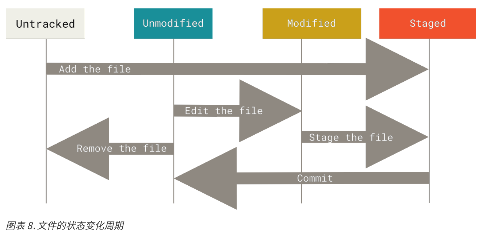

# git 初探

## 一. 基本概念

### **1. `git` 中的三个区域: working directory, staging directory, repository**

- 工作目录(working directory)
    - 当你在你的项目上工作并做了一些改变时, 你在处理你的项目的工作目录. 这个项目目录在你的计算机的文件系统中是可用的. 你所做的所有修改都将保留在工作目录中，直到你把它们添加到暂存区
- 暂存区/索引(staging directory / .index)
    - 暂存区域可以说是你下一次提交的预览。当你创建一个 git 提交时, git 会将暂存区中的修改作为一个新的提交. 你可以在暂存区中 `add` 或 `rm`
    - git 使用一个叫 index 的文件来记录暂存区
    - 注意暂存区和分支是独立的, 也就是说系统中永远只有一个暂存区, 而不是不同的分支会有不同的暂存区
- 仓库(repository) : 对象和引用的集合

### **2. `git` 中的三个对象 : blob, tree, commit**

- blob 是普通文件
- tree 是目录, 存放下一层 blob 和 tree 的引用
- commit 是某一个时间工作区的快照, 包含一个 root tree (保存快照的最上层 tree, 可以遍历整个文件夹), comment, author 和 上一个/多个 commit 节点. 每次 `commit` 都会生成一个 commit 对象, 可以称为节点

所有对象都有一个 HASH-1 的 string, 作为该对象的引用.

**`git` 中的引用** : HEAD 指向当前的 commit 对象 (或称节点), 分支名 `<branch>` 一般是该分支的最后一个 commit 对象

### **3. `git` 中文件的四种状态**

可以使用 `git status` 查看工作目录中文件的状态

## 二. 初始化操作

- `git config --global user.name xxx` 设置全局用户名，记录在 `~/.gitconfig`
- `git config --global user.email xxx@xxx.xxx` 设置全局邮箱，记录在 `~/.gitconfig`
- `git init` 将当前目录配置成 git 仓库, 信息记录在当前目录`./.git`文件夹中

## 三. 文件状态修改

### 1. `git add`

- `git add <file>` 将工作区文件 `<file>` 从工作区加入到暂存区
- `git add <dir>` 将工作区目录 `<dir>` 下所有文件从工作区加入到暂存区

### 2. `git commit`

- `git commit -m "xxxxxxxx"` 将暂存区的内容提交到仓库 `-m` 后添加备注信息. 加入 `-a` 选项跳过 `git add` 操作, 直接将工作区的未暂存的修改提交
- `git commit --amend` 修复上一次的提交. 例如提交完意识到上一次提交有工作区的修改没有加入到暂存区, 可以 `git add forgotten_file` 然后接上 `git commit --amend` 对上一次提交进行一个补充.

### 3. `git rm` 和 `git mv`

- `git rm <file>` 从工作区和仓库中删除 `<file>`. 注意该操作只有 `commit` 后才能真正提交到仓库, 也就是从仓库中删除 `<file>` 文件了. 即使你已经通过 rm 将某个文件删除掉了，也可以再通过 git rm 命令重新将该文件从 git 的记录中删除掉
- `git rm --cached <file>` 从仓库中删除 `<file>`, 但是本地文件还在. 注意该操作只有 `commit` 后才能真正提交到仓库, 也就是从仓库中删除 `<file>` 文件了
- `git mv <oldname> <newname>` 相当于 `mv <oldname> <newname> ; git rm <oldname> ; git add <newname>`

### 4. `git restore`

- `git restore <file>`
    - 工作区修改了 `<file>` , 未加入到暂存区, 该命令将丢弃工作区修改回到上一次commit状态
    - 工作区修改了 `<file>` , 加入到了暂存区, 该命令将不做任何事情
    - 工作区修改了 `<file>` , 加入到了暂存区, 工作区又修改了 `<file>` , 该命令将丢弃工作区修改回到暂存区的状态
- `git restore --staged <file>` 删除暂存区的 `<file>` , 工作区保持不变(无论工作区该文件是否和暂存区相同)

## 四. 连接远程服务器

1. 首先通过 `ssh-keygen` 生成 ssh 公钥 私钥, 保存在 `~/.ssh` 文件夹中, 私钥文件为 `id_rsa` , 公钥文件为 `id_rsa.pub` 
2. 在代码托管平台(如GitHub) 中设置 ssh 公钥
3. 在代码托管平台中创建一个空白项目
4. 在本地仓库 `git remote add <remote> 远程服务器域名(ssh版)` 将本地仓库和远程仓库建立连接, 并给远程仓库起名 `<remote>`
5.  `git push -u <remote> <branch>` 将本地项目的 `<branch>` 分支推到远程项目 `<remote>` 上. 可以通过命令 `git remote` 查看远程项目名称, 通过 `git branch` 查看本地项目分支. 注意只有第一次将本地项目push到远程项目才使用该命令(即远端无 `<branch>`分支), 之后想要将当前分支push到云端只需要 `git push`
6. `git clone <项目域名(ssh版)>` 将远程项目克隆到本地. `git reflog` 会丢失, `git log` 则保留

## 五. 分支

在多人开发的时候往往会在分支上开发

### 1. `git checkout`

- `git checkout <branch>` 切换到`<branch>`分支
- `git checkout -b <branch>` 从当前分支为起点创建 `<branch>` 分支并切换到该分支.
- `git checkout -b <branch> --track <remote>/<branch>` 以 `<remote>/<branch>` 为起点创建一个新分支 `<branch>` 并且将 `<branch>` 与 `<remote>/<branch>` 相关联. 当两个分支同名且本地无该 `<branch>` , 远端有, 则可以简写为 `git checkout <branch>`

### 2. `git branch`

- `git branch` 查看本地分支. 加上 `-a` 可以查看本地和远端分支. 加上 `-vv` 可以查看本地分支和远端分支关联情况
- `git branch <branch>` 从当前分支为起点创建一个名为 `<branch>` 的分支
- `git branch -d <branch>` 删除本地仓库的`<branch>`分支
- `git branch --set-upstream-to=<remote>/<branch> [<branch>]` 将本地 `<branch>` 分支关联到远端的 `<remote>/<branch>` 分支. 如果 `<branch>` 省略则默认为当前分支

### 3. `git push`

- `git push <remote> <srcbranch>:<dstbranch>` 将本地 `<srcbranch>` 分支 push 到远端 `<dstbranch>` 分支. 当 `<srcbranch> == <dstbranch>` 时可以只写一个
- `git push --set-upstream <remote> <branch>` 在远程创建 `<branch>` 分支, 并将本地的 `<branch>` 分支与其关联起来, 然后将本地 `<branch>` push到远端. `--set-upstream` 可以简写为 `-u`

> 注意 `git checkout, git branch, git push` 都有将本地分支关联到远端的选项
> 

### 4. `git remote`

- `git remote add <remote> <远程服务器域名(ssh版)>` 添加远程仓库, 并设置一个别名为 `<remote>`
- `git remote` 查看远程仓库名(自己设置的一个别名). 加上 `-v` 显示服务器域名
- `git remote show <remote>` 查看某一远程仓库的更多信息
- `git remote rename <oldname> <newname>` 远程仓库改名
- `git remote remove <remote>` 删除远程仓库

### 5. `git fetch`  and `git merge`

- `git fetch <remote> [<branch>]` 将远端分支拉取到本地, 得到最新的本地的远端分支, 而非本地分支.省略 `<branch>` 就会 fetch 所有的分支
- `git merge <branch>` 将 `<branch>` 和当前分支合并
- `git merge <remote>/<branch>` 将 `<remote>/<branch>` 与当前分支合并

> 注意 : 本地 `<branch>` 没有 `<remote>/` 前缀, 远地 `<branch>` 会有 `<remote>/` 前缀, 在 `git remote add <remote> <域名>` 后远端的分支其实并不会被本地感知, 在 `git fetch` 后可以将远端分支下载到本地, 但是实际上也只是本地的远端分支, 即以 `<remote>/<branch>` 形式存在的分支
> 

### 6. 配置好本地远端关联后的命令

- `git push` 将本地当前分支push到远端关联的分支
- `git pull` 将远端关联的分支pull到本地当前分支

## 六. git 查看修改

- `git status` 查看文件状态. 加 `-s` 选项输出简洁状态
- `git diff` 查看尚未暂存的工作区文件的改动. 也就是尚未暂存的工作区文件和最后一次 commit 之间的差异.
- `git diff --staged` 查看暂存区和最后一次 commit 的文件的差异. `--staged` 等于 `--cached`

> 注意 : `git diff` 和 `git diff --staged` 交集为空, 并集为上一次 commit 之后的所有变动.
> 
- `git log` 按照时间顺序列出所有的提交. 加 `-p` 选项会显示每次提交引入的差异.

## 七. 杂项

### 1. `git tag`

git 可以给仓库的某一次 commit 打上标签, 以强调其里程碑意义. 

- `git tag` 列出所有标签
- `git show <tagname>` 查看某一个标签信息
- `git tag -l "<pattern>"` 按照通配符 `<pattern>` 列出符合的标签
- `git tag <tagname>` 创建名为 `<tagname>` 的标签. 该命令有选项 `-a, -s and -m` 可自行查看
- `git tag <tagname> <部分校验和>` 给之前的某一次提交打标签
- `git tag -d <tagname>` 删除某一个 tag `<tagname>`